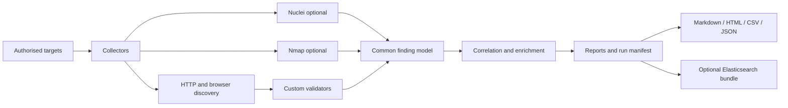

# Attack Surface Mapper

[](https://github.com/Gabrielvcg/attack-surface-mapper/actions/workflows/ci.yml)
[](https://www.python.org/)
[](CHANGELOG.md)
[](LICENSE)

Pipeline-based attack-surface discovery, validation, correlation and reporting for authorised security testing and controlled labs.

Attack Surface Mapper combines HTTP discovery, custom AppSec validators, optional Nuclei and Nmap integrations, finding correlation, prioritisation and multi-format reporting. The project is designed around an explicit trade-off between noise, coverage and signal quality instead of treating every discovered endpoint as a vulnerability.

> **Responsible use:** run this tool only against systems you own or are explicitly authorised to test. Start with a passive profile and increase coverage deliberately. See [SECURITY.md](SECURITY.md) before scanning.

## Why this project is interesting

The engineering focus is the pipeline around the scanners:

- one shared `Vulnerability` contract across HTTP, browser, Nuclei and Nmap evidence;
- staged execution with reusable observed URLs, actions and API references;
- semantic correlation and deduplication to reduce duplicate and low-signal findings;
- explicit `confidence`, `finding_role`, `verification_status` and numeric priority scoring;
- passive, safe-recon, enumeration and active profiles with different operational risk;
- deterministic JSON, Markdown, HTML and CSV outputs for human review and automation;
- aggregate reporting across targets, comparison between runs and optional Elasticsearch bundles;
- tests for parsers, false-positive regressions, reporting contracts and lab behaviour.

## Architecture



Execution is orchestrated as:

1. Nuclei collection when enabled.
2. Nmap collection when enabled.
3. Browser discovery and crawling.
4. Passive HTTP validation.
5. Correlation and enrichment.
6. Per-target and aggregate reporting.

See [the pipeline guide](docs/PIPELINE.md) and [the architecture note](docs/ARCHITECTURE.md) for the detailed contracts.

## Quick start

### Requirements

- Python 3.11 or newer.
- Nuclei in `PATH` for profiles that enable Nuclei.
- Nmap in `PATH` only when network reconnaissance is enabled.
- Playwright browsers only for dynamic Scrapling execution.

### Install

```bash
python3 -m venv .venv
source .venv/bin/activate
python -m pip install --upgrade pip
python -m pip install -e ".[dev]"
```

On Windows PowerShell:

```powershell
py -3.11 -m venv .venv
.\.venv\Scripts\Activate.ps1
python -m pip install --upgrade pip
python -m pip install -e ".[dev]"
```

Install external tools only when needed. For dynamic crawling:

```bash
python -m playwright install
```

### First scan

Use a target you own or a local lab target. The safe profile performs GET-oriented, observed-surface discovery without Nuclei, Nmap or invented endpoint probing:

```bash
python main.py --profile passive-recon-safe https://TARGET-YOU-AUTHORISE/
```

For a minimal local smoke run:

```bash
python main.py --profile passive-stealth https://example.com/
```

The CLI target is combined with targets from YAML and deduplicated. It does not replace YAML targets; this keeps multi-target configuration explicit.

## Operational profiles

| Profile | Noise | Coverage | External tools | Intended use |
| --- | --- | --- | --- | --- |
| `passive-stealth` | Lowest | Observed surface only | None | Low-noise authorised observation |
| `passive-recon-safe` | Low | Safe navigation and JS hints | None | Recommended starting point |
| `passive-recon-enum` | Medium | Controlled endpoint enumeration | Nuclei | Authorised recon with broader coverage |
| `active-aggressive` | Highest | HTTP, browser, Nuclei and Nmap | Nuclei, Nmap, Playwright | Approved audits and lab environments |

Profile files live in [`config/profiles`](config/profiles). The older `passive-recon`, `passive`, `active` and `deep` names remain available for compatibility; use the explicit profiles above for new runs.

Examples:

```bash
python main.py --profile passive-stealth https://TARGET-YOU-AUTHORISE/
python main.py --profile passive-recon-safe https://TARGET-YOU-AUTHORISE/
python main.py --profile passive-recon-enum https://TARGET-YOU-AUTHORISE/
python main.py --profile active-aggressive --use-nmap https://TARGET-YOU-AUTHORISE/
python main.py --targets-file targets.txt --profile passive-recon-safe
python main.py --config config/examples/config.example.yml
```

## Output contract

Each run is written below `scans/<run-name-or-timestamp>/`:

```text
run_manifest.json
reports/
  aggregate_summary.json
  aggregate_report.md
  aggregate_findings.csv
targets/<target>/
  findings/vulnerabilities.json
  reports/report.md
  reports/report.html
  reports/report.csv
  reports/report.summary.json
  artifacts/nuclei_raw.jsonl
  artifacts/nmap_raw.xml
  debug/
```

Start with `reports/aggregate_report.md` for a human overview, then use `run_manifest.json` and the structured summaries to understand what actually ran. Raw artefacts are retained per target and should be treated as potentially sensitive scan data.

The common finding contract includes stable IDs, source, severity, category, confidence, validation status, evidence summaries, asset identity, correlation metadata and scoring rationale. See [OUTPUTS.md](docs/OUTPUTS.md).

## Local lab validation

The repository includes regression tests and a repeatable lab helper for controlled Juice Shop and DVWA environments. Do not point the lab scripts at an unowned target.

```bash
python -m pytest -q
python -m compileall -q main.py src
```

On Windows, the PowerShell validation helper is:

```powershell
.\scripts\validate_labs.ps1
```

The lab flow exercises passive profiles, manifest validation, stable IDs and a minimum findings threshold. It is intentionally separate from the default unit-test suite.

## Project map

```text
main.py                         CLI and run orchestration
src/attack_surface_mapper/      Pipeline implementation
config/profiles/                Operational profile presets
config/examples/                Reproducible YAML examples
tests/                          Unit and regression coverage
docs/PIPELINE.md                Stage and data-flow details
docs/PROFILES.md                Profile semantics and trade-offs
docs/OUTPUTS.md                 Output contract and artefacts
docs/ARCHITECTURE.md            Design boundaries and decisions
scripts/                        Lab validation and export helpers
SECURITY.md                     Authorised-use and vulnerability policy
```

The fastest review path is:

1. [Architecture](docs/ARCHITECTURE.md)
2. [Profiles](docs/PROFILES.md)
3. [Pipeline](docs/PIPELINE.md)
4. [Output contract](docs/OUTPUTS.md)
5. [Tests](tests)

## Quality and security posture

Every push and pull request runs source compilation and the full pytest suite through GitHub Actions. Dependency auditing is defined in the security workflow. Generated scan outputs, local credentials, virtual environments, editor metadata and build artefacts are excluded by `.gitignore`.

Before a public release, review the complete reachable Git history for credentials and inspect generated examples for real hosts, personal data and operational identifiers. Never commit `.env` files, private keys, tokens, VPS credentials or raw reports from real engagements.

## Roadmap

- Improve reproducible lab fixtures and representative report samples.
- Continue reducing false positives without hiding ambiguous evidence.
- Keep output schemas stable while extending integrations.
- Add focused performance benchmarks for large target sets.

## License

Released under the [MIT License](LICENSE). Use of the tool remains subject to the authorised-testing requirements in [SECURITY.md](SECURITY.md).

## Contact and contribution

Bug reports and improvements are welcome through the repository issue tracker. For security-sensitive reports, follow [SECURITY.md](SECURITY.md) and do not publish credentials or live-target details in a public issue.
