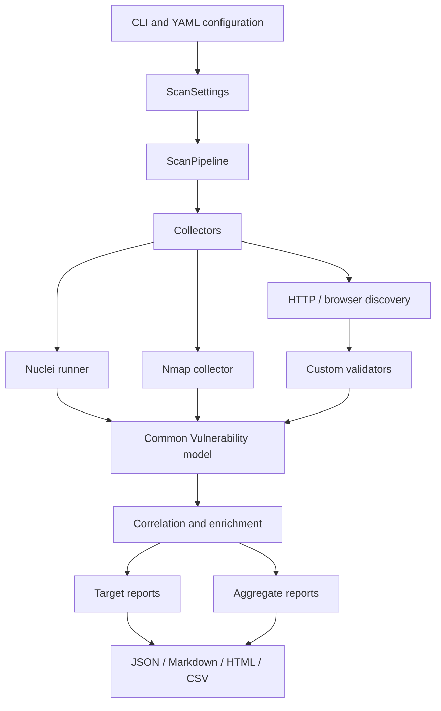

# Architecture

## System boundary

Attack Surface Mapper is a local, operator-controlled CLI. It does not provide a hosted control plane, accept unauthenticated scan jobs or store results in a remote service by default. The operator supplies authorised targets, selects a profile and owns the generated artefacts.

## Pipeline responsibilities

- **Collectors** gather observable evidence and invoke optional external tools.
- **Validators** turn responses, navigation and tool output into candidate findings.
- **The common model** preserves source, evidence, target identity, severity and verification metadata.
- **Correlation** deduplicates findings and groups related signals without treating discovery as confirmed impact.
- **Enrichment** calculates confidence, priority, recommendation and stable identifiers.
- **Reporting** emits human-readable and machine-readable contracts without requiring Elasticsearch.

`ScanContext` is the shared execution state. `ScanOrchestrator` remains a compatibility facade and delegates execution to the pipeline. This keeps CLI compatibility while allowing stages to evolve independently.

## Design decisions

1. **Observed surface before invented probes:** safe profiles reuse links, forms, scripts and API references observed during navigation.
2. **Evidence before severity:** a discovered or likely signal is not presented as a confirmed vulnerability without the corresponding validation basis.
3. **One finding contract:** HTTP, browser, Nuclei and Nmap findings share the same serialisation and reporting path.
4. **Progressive escalation:** operators select the smallest profile that answers the authorised question.
5. **Local-first artefacts:** reports stay on the operator's filesystem unless the operator explicitly exports a generated bundle.

For profile semantics, see [PROFILES.md](PROFILES.md). For output compatibility, see [OUTPUTS.md](OUTPUTS.md).
